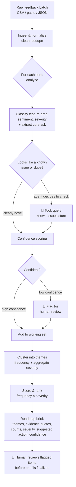

# Signal — Turn the noise of user feedback into a prioritized roadmap

**An AI agent that reads hundreds of scattered, messy user-feedback items and produces an evidence-backed, prioritized roadmap brief — with every recommendation traceable to the exact feedback that supports it, and a human-in-the-loop checkpoint before anything is finalized.**

[🔗 **Live demo**](https://signal-theta-ten.vercel.app/) · [🧪 **Eval results**](#7-evaluation--how-i-measured-quality) · [🗺️ **Architecture graph**](https://signal-theta-ten.vercel.app/architecture.html)

> **Why this exists, in one breath:** Product teams drown in feedback across support tickets, app reviews, surveys, and sales calls. Synthesizing it into a roadmap takes days of manual reading and is biased toward whatever's loudest or most recent. Signal does the synthesis in minutes, uniformly across every item, and hands the PM a defensible starting point — not a black-box answer.

---

## Table of contents

1. [TL;DR](#1-tldr)
2. [The problem](#2-the-problem)
3. [Who this is for](#3-who-this-is-for)
4. [Goals & non-goals](#4-goals--non-goals)
5. [Success metrics](#5-success-metrics)
6. [How it works](#6-how-it-works)
7. [Evaluation — how I measured quality](#7-evaluation--how-i-measured-quality)
8. [Key product decisions & tradeoffs](#8-key-product-decisions--tradeoffs)
9. [Designing for AI failure modes](#9-designing-for-ai-failure-modes)
10. [Roadmap](#10-roadmap)
11. [Known limitations](#11-known-limitations)
12. [Tech stack](#12-tech-stack)
13. [Getting started](#13-getting-started)
14. [Repo structure](#14-repo-structure)
15. [Appendix](#15-appendix)

---

## 1. TL;DR

Signal is an **agentic** feedback-triage tool. You point it at a batch of raw feedback; it works through each item — classifying the feature area, sentiment, and severity, extracting the core ask, and checking the item against your existing known-issues list — then clusters everything into themes, scores them by frequency and severity, and produces a prioritized roadmap brief. Anything it isn't confident about is flagged for a human to review before the brief is finalized.

It is deliberately built as a **decision-support tool, not a decision-maker.** Every output traces back to source feedback, and the PM stays in the loop. The interesting work here isn't "call an LLM on some text" — it's the product judgment around scope, trust, measurement, and graceful failure, which is documented throughout this README.

**Built by Faraz Ali, an AI Product Manager** — including the code, prototyped with heavy LLM assistance. I treat being able to ship my own ideas as part of the job. [LinkedIn](https://www.linkedin.com/in/-faraz/) · [Portfolio](https://faraz-website.vercel.app/)

---

## 2. The problem

Product teams receive feedback through many channels at once — app-store and Play-Store reviews, support tickets, post-purchase surveys, and social media. Turning that pile into a confident "here's what we should build next" is slow and error-prone:

- **It's scattered.** No single place holds all of it, so synthesis means manually pulling from several tools.
- **It's slow.** Reading and tagging a few hundred items by hand takes ~1–2 days of focused PM time — time that recurs every planning cycle.
- **It's biased.** Humans over-weight the loudest complaint, the most recent ticket, or the one from the biggest customer. Quiet-but-widespread issues get missed.
- **It's hard to quantify.** "A lot of people mentioned onboarding" is not a number a roadmap argument can stand on.
- **It doesn't compound.** Last quarter's synthesis lives in a doc nobody reopens; there's no consistent, repeatable lens across cycles.

**Cost of the status quo:** PM hours spent on low-leverage reading instead of strategy; roadmap decisions defended with anecdotes rather than evidence; real signal lost in the volume.

**Why now:** Until recently, doing this well meant building an NLP pipeline — labeled training data, topic models, an ML engineer. Modern LLMs read unstructured text, cluster it semantically, and reason about severity at near-human quality, for cents per run and minutes of wall-clock time. The capability that used to require a data-science team is now a prompt-and-orchestration problem a single PM can prototype. That shift is the entire reason this product is feasible today.

---

## 3. Who this is for

**Primary persona — "Priya, the Product Manager"**

| | |
|---|---|
| **Role** | PM at a direct-to-consumer e-commerce company, owning the shopping/checkout experience |
| **Context** | Receives 200–800 feedback items per planning cycle across 5 channels |
| **Today's workflow** | Exports feedback to a spreadsheet, reads and color-codes by hand, eyeballs themes, writes a summary doc |
| **Core frustration** | "By the time I've finished reading everything, I've spent two days and I'm still not sure I weighted it right." |

**Job to be done:**
> *When* I'm planning the next cycle and I'm staring at hundreds of scattered feedback items,
> *I want to* quickly see the top themes with their frequency and severity, backed by the actual quotes,
> *so I can* decide what to build next with evidence I can defend to leadership — instead of going with my gut.

**Secondary users:** founders without a dedicated PM; customer-success leads building the case for a fix; UX researchers triaging study notes.

---

## 4. Goals & non-goals

### Goals
- Cut time-from-raw-feedback-to-prioritized-brief from days to minutes.
- Surface themes with **frequency + severity**, each grounded in source quotes.
- Reduce recency/loudness bias by processing every item through the same lens.
- Keep a human in the loop: the agent proposes, the PM disposes.
- Make every recommendation **auditable** — no claim without a traceable source.

### Non-goals (v1)
- ❌ **Not** auto-writing tickets to Jira/Linear. The agent recommends; it doesn't act on your tracker. (A v2 candidate — see [Roadmap](#10-roadmap).)
- ❌ **Not** a real-time streaming pipeline. It runs on a batch you give it, on demand.
- ❌ **Not** an executive analytics dashboard. The output is a working brief for a PM, not a BI tool.
- ❌ **Not** a replacement for PM judgment. It's explicitly decision-*support*; final prioritization stays human.
- ❌ **Not** handling audio/video feedback or non-English input in v1. Text-in, structured-brief-out.

---

## 5. Success metrics

### North-star metric
**Time-to-insight:** wall-clock time from "raw feedback in" to "PM-approved roadmap brief out."
*Target:* reduce from ~2 days manual → **< 15 minutes** assisted.

### Quality metrics (the ones that prove the AI is trustworthy)
| Metric | What it measures | Target | Actual |
|---|---|---|---|
| Categorization agreement | % of items where the agent's feature-area + severity match my human label | ≥ 85% | 73% — feature-area 90%, severity 83% (v2; v1 was 50% / 60%) |
| Theme recall | Of the themes a human found, % the agent also surfaced (did it miss anything big?) | ≥ 90% | 100% |
| Theme precision | Of the themes the agent surfaced, % a human agrees are real (no invented themes) | ≥ 90% | 95% |
| **Hallucination rate** | % of recommendations not traceable to ≥1 real source item | **0% (hard guardrail)** | 0% |

### Trust & efficiency metrics
| Metric | What it measures | Target | Actual |
|---|---|---|---|
| Human-acceptance rate | % of agent-suggested priorities the PM keeps without override | ≥ 70% | — (not instrumented in v1) |
| Review-flag precision | Of items flagged for human review, % that genuinely needed it | ≥ 60% | — (not instrumented in v1) |
| Cost per run | API spend to process one full batch | < $0.10 | ~$0.02 |
| Latency per run | Wall-clock time for 30 items | < 2 min | ~33s |

> **The metric I'd optimize first** is hallucination rate, because trust is the whole product. A fast, cheap brief that invents a theme is worse than useless — it actively misleads a roadmap decision. Speed and cost come after correctness.

---

## 6. How it works

Signal runs an agent loop over the feedback batch. The agent doesn't just transform data step by step — it **makes decisions per item**: whether the item needs a context lookup, how confident it is, and whether to escalate to a human.



**Walkthrough of one run:**
1. **Ingest.** The PM uploads a CSV (or pastes text). Items are normalized and exact/near-duplicates are collapsed.
2. **Per-item analysis.** For each item the agent classifies the feature area, sentiment, and severity, and extracts the underlying ask in plain language.
3. **Context tool (agentic decision).** When an item looks like it might already be tracked, the agent calls a `lookup_known_issues` tool to check the existing roadmap/known-issues store, and decides: *new*, *duplicate of known*, or *related*.
4. **Confidence + human-in-the-loop (agentic decision).** Each classification carries a confidence score. Items below a threshold are flagged for human review rather than silently guessed.
5. **Synthesis.** Items are clustered into themes; the agent counts frequency and aggregates severity per theme.
6. **Prioritization.** Themes are ranked by an **explainable** score (frequency × severity, with the formula visible — see [Decision 6](#8-key-product-decisions--tradeoffs)).
7. **Brief.** Output is a prioritized roadmap brief where every theme lists its frequency, severity, suggested action, confidence, and **the actual source quotes** backing it.
8. **Review.** Before finalizing, the PM resolves any flagged items in the UI.

---

## 7. Evaluation — how I measured quality

I built a **golden set** of 30 feedback items, hand-labeled by me (the PM) with the correct feature area, severity, and theme. The eval harness (`evals/run-eval.ts`, run with `npm run eval`) runs the agent against this set and reports the [quality metrics above](#5-success-metrics).

### Results

**Current results (v2) — 30-item golden set, via `npm run eval`:**

| Metric | Result | Target |
|---|---|---|
| Categorization agreement (feature-area + severity) | 73% | ≥ 85% |
| · feature-area only | 90% | — |
| · severity only | 83% | — |
| Theme recall | 100% | ≥ 90% |
| Theme precision | 95% | ≥ 90% |
| Hallucination rate | 0% | 0% |

Run stats: 22 themes · 10 of 30 items flagged for human review · 0 themes dropped as ungrounded · 0 invented citations · 0 schema re-requests · ~33s wall-clock.

These are post-iteration numbers. The first run (v1) scored 50% combined agreement; the entire gap was severity (60%), which I diagnosed and fixed — see the failure-mode analysis below. Feature-area (90%), theme quality, and grounding were strong from the first run; severity was the one lever, and sharpening its rubric lifted combined agreement **50% → 73%** with no regression anywhere else.

The combined-agreement headline (73%) is the strictest possible cut — it requires *both* feature-area and severity to match on the same item. It sits just under the ≥85% target, and I've left it there honestly rather than tuning to clear the line: the residual gap is a handful of genuinely subjective 3-vs-4 severity calls plus the ~10% of feature-area edge cases, which is exactly why the product keeps a human in the loop.

> Note: the eval calls a live LLM, so exact percentages wobble a few points run to run. The +23-point severity gain is well beyond that noise.

### Failure-mode analysis

| Failure observed | Why it happened | What I changed | Result |
|---|---|---|---|
| Severity miscalibrated at the 3-vs-4 line — the agent over-rated friction-with-a-workaround issues (FB-013, FB-023: broken saved-card checkout you can still pay through, marked Critical where I judged High) and under-rated true losses (FB-026 "paid but never received", FB-029 "payment fails 3× and money is held", marked High where I judged Critical) | The rubric named "workaround" as a 3-signal but had no concrete checkout example, so the model defaulted to "anything blocking checkout = 4" | Sharpened `SEVERITY_RUBRIC` into an explicit decision rule — workaround exists / purchase still completes → 3; fully blocked, money lost, or data exposed → 4 — with anchored examples mapping onto the exact failing rows | severity agreement 60% → **83% (+23 pts)**; combined agreement 50% → 73% |
| Risk of inventing a theme absent from the data (a classic LLM failure) | LLMs pattern-match to common complaints even when they aren't in the input | Hard guardrail: every theme must cite ≥1 real source id, validated in code; ungrounded themes are dropped | Measured 0% hallucination, 0 invented citations on the golden set |

### How I iterated

v1 of the agent scored 50% combined categorization agreement. Reading `results.md`, the gap was almost entirely severity (60% vs. 90% on feature-area): the agent rated friction-with-a-workaround issues — most clearly a broken saved-card checkout you can still pay through — as Critical, where my labels called them High because the order still completes. I sharpened the severity rubric's 3-vs-4 boundary with an explicit decision rule (workaround exists / purchase completes → 3; fully blocked, money lost, or data exposed → 4) and anchored examples, then re-ran. Severity agreement rose **60% → 83%** and combined agreement **50% → 73%**, with feature-area, theme quality, and hallucination rate all unchanged — confirming the rubric was the single lever. The residual gap is genuinely subjective 3/4 calls, which is why a human stays in the loop (see [Decision 1](#8-key-product-decisions--tradeoffs)). That measure → diagnose → fix → re-measure loop is the core of the work.

---

## 8. Key product decisions & tradeoffs

**Decision 1 — Decision-support, not automation.**
*Options:* (a) auto-create tickets and act on the tracker; (b) propose a brief and keep a human in the loop.
*Chose:* (b). *Why:* the cost of a wrong roadmap call is high, PM trust is the adoption bottleneck, and a tool that quietly automates bad judgment is dangerous. *Gave up:* end-to-end speed and the "magic" of full automation. *Revisit when:* eval shows acceptance rate consistently > 90% on low-stakes categories.

**Decision 2 — Per-item analysis over one giant batch prompt.**
*Options:* (a) stuff all feedback into one prompt and ask for themes; (b) analyze items individually (or in small batches), then synthesize.
*Chose:* (b). *Why:* per-item analysis is more accurate, traceable (I can point to exactly how each item was classified), and evaluable. *Gave up:* lower cost and latency. *Mitigation:* batch easy items and route them to a cheaper model (see Decision 3).

**Decision 3 — Model routing (cheap vs. capable).**
*Options:* (a) one strong model for everything; (b) route simple classification to a cheaper/faster model and reserve the capable model for synthesis and low-confidence cases.
*Chose:* (b). *Why:* most items are easy to classify; spending top-tier tokens on them is waste. *Gave up:* some simplicity. *Tradeoff surfaced:* this is the main cost/quality lever, documented so reviewers see I think about unit economics.

**Decision 4 — Enforced structured output.**
*Options:* (a) free-text responses I parse heuristically; (b) enforce a strict JSON schema for every model response.
*Chose:* (b). *Why:* structured output makes results reliable, programmatically usable, and — critically — measurable against the golden set. *Gave up:* a little model flexibility and the occasional re-ask when the schema is violated.

**Decision 5 — Confidence threshold for human review.**
*Options:* where to set the bar for flagging an item.
*Chose:* 0.7 tuned on the golden set. *Why:* this is a precision/recall tradeoff — flag too much and you re-create the manual workload (defeating the point); flag too little and errors slip through. *Documented metric:* review-flag precision (see [metrics](#5-success-metrics)).

**Decision 6 — Explainable prioritization over a black-box ranking.**
*Options:* (a) ask the LLM to "rank these themes"; (b) compute a transparent frequency × severity score the PM can see and adjust.
*Chose:* (b). *Why:* a PM has to *defend* a roadmap to leadership; "the AI ranked it this way" is not a defensible argument, but "23 high-severity reports vs. 4 low-severity ones" is. **Explainability beats sophistication when the user has to justify the output to someone else.** *Gave up:* the model's nuanced judgment on ranking — which I reintroduce as a *suggested* re-order the PM can accept or ignore.

---

## 9. Designing for AI failure modes

LLMs are confident, fluent, and sometimes wrong. The product is designed around that reality:

- **Grounding / no claim without a source.** Every theme in the brief must cite ≥ 1 real feedback item, shown as a quote. This is a hard guardrail, validated programmatically, and it drives the hallucination rate toward 0. If the agent can't ground a claim, the claim is dropped.
- **Confidence + human-in-the-loop.** Low-confidence classifications are surfaced for review, not silently committed. The human is the safety net exactly where the model is weakest.
- **Schema validation.** Outputs that violate the expected structure are caught and re-requested rather than silently mishandled.
- **Anchored rubrics over vibes.** Severity uses a concrete 1–4 rubric with examples (see [Appendix](#15-appendix)), which sharply reduces severity drift — and was the single change that lifted severity agreement from 60% to 83% (see [Evaluation](#7-evaluation--how-i-measured-quality)).
- **Bias toward recall on critical signal.** The prioritization is tuned so a rare-but-severe issue isn't buried under volume — frequency and severity are weighted, not frequency alone.
- **Known failure modes (documented, not hidden):** over-merging similar themes, severity inflation, sycophantic agreement with the framing of the input, missing rare items. Each is tracked in the [eval](#7-evaluation--how-i-measured-quality).

**Prompt strategy (brief):** each agent step uses a role + explicit rubric + a few labeled examples + an enforced output schema. Prompts live in `src/lib/agent/prompts.ts` so they're version-controlled and diffable — prompt changes are treated as product changes.

---

## 10. Roadmap

### ✅ MVP (this repo)
Batch ingest → per-item agentic analysis → context-tool lookup → human-in-the-loop review → prioritized, grounded roadmap brief, in a runnable Next.js app with an eval harness.

### 🔜 v2 — candidates (prioritized)
1. **Write-back to Jira/Linear** for accepted themes (the most-requested workflow close-out).
2. **Multi-channel auto-ingest** (connect Zendesk / app-store APIs directly instead of manual export).
3. **Trend-over-time** — compare this cycle's themes to last cycle's to show momentum.
4. **Configurable prioritization model** — let teams weight frequency vs. severity vs. customer tier.

### 🅿️ Explicitly deferred
Exec dashboards, non-text feedback, multi-language, real-time streaming — out of scope until the core synthesis loop is proven valuable. (See [Non-goals](#4-goals--non-goals).)

---

## 11. Known limitations

- **Quality depends on input quality.** Garbled or context-free feedback gets garbled analysis.
- **Severity is inherently subjective** — the rubric reduces but doesn't eliminate disagreement; that's why the human reviews.
- **The golden set is small** (30 items) and reflects my own judgment; agreement metrics should be read as directional, not definitive.
- **No multi-language / non-text support** in v1.
- **Costs scale with volume** — very large batches need the model-routing optimization to stay cheap.

---

## 12. Tech stack

| Layer | Choice | Why |
|---|---|---|
| Language | TypeScript | One language across UI + server; type-safe structured outputs |
| UI | Next.js (App Router) + React + Tailwind CSS v4 | Premium custom UI; the agent runs in the same codebase via server-side API routes |
| Design | Accessible Neumorphism ([`design-system/MASTER.md`](design-system/MASTER.md)) | Premium, tactile look with WCAG-compliant guardrails |
| LLM | OpenAI API (model configurable via env) | Reasoning + structured-output support; easy to swap models |
| Agent loop | Hand-rolled (no heavy framework) | So I can fully explain how it works — an explainable loop beats an unexplainable framework |
| Storage | JSON files (`data/`) | Simple, zero-setup context + state store |
| Eval | Custom harness (`evals/`) | Measures output quality against a labeled golden set |
| Deploy | Vercel | GitHub-connected, one-click deploy, gives a live demo link |

---

## 13. Getting started

```bash
# 1. Clone
git clone https://github.com/FarazO7/Signal.git
cd Signal

# 2. Install dependencies
npm install

# 3. Add your API key (server-side only — never shipped to the browser)
cp .env.example .env
# then open .env and paste your key, e.g. OPENAI_API_KEY=sk-...

# 4. Run it
npm run dev
```
Then open the local URL Next.js prints (default `http://localhost:3000`), load the included `data/sample_feedback.json`, and watch it produce a brief.

**Run the eval:**
```bash
npm run eval
```
**Other commands:**
```bash
npm run build   # production build
npm run lint    # eslint
```

### Deploy to Vercel

The app is deploy-ready — no extra config. To put it live:

1. **Push to GitHub** (the local repo has no remote yet):
   ```bash
   git remote add origin https://github.com/FarazO7/Signal.git
   git push -u origin main
   ```
2. **Import to Vercel** — at [vercel.com/new](https://vercel.com/new), select the repo. The Next.js preset is auto-detected; nothing to change.
3. **Set the key** — in the Vercel project's **Settings → Environment Variables**, add `OPENAI_API_KEY` (optionally `SIGNAL_MODEL_CHEAP` / `SIGNAL_MODEL_SMART`). It stays server-side; it is never exposed to the browser.
4. **Deploy**, then update the live-demo link at the top of this README.

> The `/api/analyze` route is configured for up to 60s (`maxDuration`); the sample runs the cheap model per item to stay well within that.

---

## 14. Repo structure

```
signal/
├── README.md                      # ← you are here (the PRD)
├── CLAUDE.md                      # stack, conventions, how to run
├── AGENTS.md                      # agent rules (imports CLAUDE.md)
├── design-system/
│   └── MASTER.md                  # the Neumorphism design system
├── src/
│   ├── app/
│   │   ├── page.tsx               # main UI
│   │   ├── layout.tsx             # root layout (fonts, metadata)
│   │   ├── globals.css            # design-system implementation (tokens + primitives)
│   │   └── api/                   # server-side agent endpoints
│   ├── components/                # UI components incl. neumorphic primitives
│   └── lib/
│       └── agent/                 # the agent
│           ├── loop.ts            # the agent loop (decisions, tool calls, confidence)
│           ├── prompts.ts         # version-controlled prompt templates
│           ├── tools.ts           # lookup_known_issues tool
│           └── schema.ts          # structured-output schemas
├── data/
│   ├── sample_feedback.json       # demo input (~50 items)
│   └── known_issues.json          # context store for lookup_known_issues
├── evals/
│   ├── golden_set.csv             # hand-labeled test set (the correct_* columns are my labels)
│   ├── run-eval.ts                # eval harness (npm run eval)
│   └── results.md                 # metrics + failure-mode analysis
├── graphify-out/                  # architecture graph (report + interactive HTML + JSON)
├── public/architecture.html       # the interactive graph, served live at /architecture.html
├── .env.example                   # template for your OPENAI_API_KEY
├── package.json
└── next.config.ts
```

### Architecture graph

Generated with [graphify](https://github.com/safishamsi/graphify) (deterministic AST extraction over `src/` — 78 nodes, 161 edges, 6 communities, 0 import cycles). It maps the real call graph: the API route → `analyzeFeedback` → the per-item agent loop (`analyzeItemWithAgent`) → the `lookup_known_issues` tool, schema validation, and the shared scoring formula.

- 📄 [`graphify-out/GRAPH_REPORT.md`](graphify-out/GRAPH_REPORT.md) — the report (renders on GitHub)
- 🗺️ Interactive graph: [`graphify-out/graph.html`](graphify-out/graph.html) (download/open) · **live at [/architecture.html](https://signal-theta-ten.vercel.app/architecture.html)**

---

## 15. Appendix

### Severity rubric (used by the agent and by me when labeling the golden set)
| Level | Label | Definition | Example |
|---|---|---|---|
| 4 | Critical | Blocks core use; money lost; data exposed; churn risk | Payment fails at checkout, so the order can't be completed |
| 3 | High | Major friction; a workaround exists but it's painful | A saved card won't apply at checkout, so the shopper has to delete and re-enter it to pay |
| 2 | Medium | Noticeable annoyance; not blocking | Product images load slowly on the listing page |
| 1 | Low | Cosmetic / nice-to-have | The wishlist icon is hard to spot in the top nav |

### Sample prompt (excerpt)

The agentic per-item classifier. Note the shared severity rubric injected via `${SEVERITY_RUBRIC}` (so the agent and the golden set use one source of truth), the model deciding for itself whether to call the `lookup_known_issues` tool, the calibrated confidence score, and the strict JSON schema every response must conform to:

```ts
export const CLASSIFY_SYSTEM_AGENT = `You are a precise product-feedback analyst for a direct-to-consumer e-commerce store.
Analyze ONE piece of user feedback. Be literal — judge only what the text says, do not invent problems.

${SEVERITY_RUBRIC}

You have a tool, lookup_known_issues. Decide for yourself whether to use it:
- Call it when the feedback sounds like a concrete problem that might already be a tracked bug or a duplicate
  (a checkout failure, a charge problem, a broken feature, etc.). Use a few keywords as the query.
- Skip it for clear praise, vague comments, or obviously novel feature asks.
After any tool result, use it to decide if this item is a known/duplicate issue.

feature_area: a short reusable label (e.g. "Checkout & payments", "Shipping & delivery", "Returns & refunds",
"Search & discovery", "Account & auth", "Product info", "Performance & reliability", "Promotions & pricing",
"Cart", "Notifications & account", "Privacy & data", "Trust & dark patterns"). Prefer reusing one of these.

confidence: your calibrated confidence (0.0–1.0) that this classification is correct. Be honest — use lower values
for ambiguous, terse, or hard-to-place feedback, higher for clear-cut cases.

When you are done (after any tool calls), respond with a JSON object EXACTLY of this shape:
{
  "feature_area": string,
  "sentiment": "positive" | "neutral" | "negative" | "mixed",
  "severity": 1 | 2 | 3 | 4,
  "core_ask": string,                 // the underlying problem/request, one plain sentence
  "confidence": number,               // 0.0–1.0
  "known_issue_id": string | null,    // a KI-id from a tool result if this matches one, else null
  "reasoning": string                 // one sentence: your classification + whether it's a known issue
}`;
```

### Persona detail & JTBD
See [Section 3](#3-who-this-is-for).

---

*Built by Faraz Ali · [LinkedIn](https://www.linkedin.com/in/-faraz/) · [Portfolio](https://faraz-website.vercel.app/) · An AI Product Manager who ships.*
