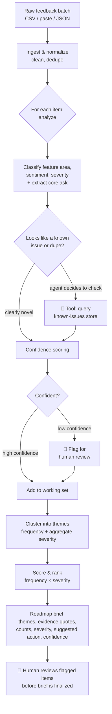

<!--
═══════════════════════════════════════════════════════════════════════════
 HOW TO USE THIS TEMPLATE  (this block is an HTML comment — it will NOT show
 when GitHub renders the page, so you can leave it in or delete it.)
 1. Anything in [SQUARE BRACKETS] is a placeholder — replace it with your own
    specifics (your domain, your real numbers, your decisions).
 2. Comments like this one (<!-- 💡 ... -->) are coaching notes for you only.
    They won't render. Read them, act on them, then delete or keep — your call.
 3. Fill the numbers in AFTER you build + run your eval. Empty metrics are fine
    while you're building; a portfolio reviewer just needs to see you measured.
 4. Rename the project. I used "Signal" as a working name — make it yours.
═══════════════════════════════════════════════════════════════════════════
-->
# Signal — Turn the noise of user feedback into a prioritized roadmap
<!-- 💡 One sharp sentence beats a paragraph here. A reviewer decides in 5 seconds whether to keep reading. -->
**An AI agent that reads hundreds of scattered, messy user-feedback items and produces an evidence-backed, prioritized roadmap brief — with every recommendation traceable to the exact feedback that supports it, and a human-in-the-loop checkpoint before anything is finalized.**
[🔗 **Live demo**](https://your-app.vercel.app) · [📹 **90-second walkthrough**](#) · [🧪 **Eval results**](#7-evaluation--how-i-measured-quality)
<!-- 💡 A clickable live demo + a short video are the two highest-leverage things in this whole repo. A reviewer will click, not clone. Prioritize getting these live. -->
> **Why this exists, in one breath:** Product teams drown in feedback across support tickets, app reviews, surveys, and sales calls. Synthesizing it into a roadmap takes days of manual reading and is biased toward whatever's loudest or most recent. Signal does the synthesis in minutes, uniformly across every item, and hands the PM a defensible starting point — not a black-box answer.
---
## Table of contents
1. [TL;DR](#1-tldr)
2. [The problem](#2-the-problem)
3. [Who this is for](#3-who-this-is-for)
4. [Goals & non-goals](#4-goals--non-goals)
5. [Success metrics](#5-success-metrics)
6. [How it works](#6-how-it-works)
7. [Evaluation — how I measured quality](#7-evaluation--how-i-measured-quality)
8. [Key product decisions & tradeoffs](#8-key-product-decisions--tradeoffs)
9. [Designing for AI failure modes](#9-designing-for-ai-failure-modes)
10. [Roadmap](#10-roadmap)
11. [Known limitations](#11-known-limitations)
12. [Tech stack](#12-tech-stack)
13. [Getting started](#13-getting-started)
14. [Repo structure](#14-repo-structure)
15. [Appendix](#15-appendix)
---
## 1. TL;DR
Signal is an **agentic** feedback-triage tool. You point it at a batch of raw feedback; it works through each item — classifying the feature area, sentiment, and severity, extracting the core ask, and checking the item against your existing known-issues list — then clusters everything into themes, scores them by frequency and severity, and produces a prioritized roadmap brief. Anything it isn't confident about is flagged for a human to review before the brief is finalized.
It is deliberately built as a **decision-support tool, not a decision-maker.** Every output traces back to source feedback, and the PM stays in the loop. The interesting work here isn't "call an LLM on some text" — it's the product judgment around scope, trust, measurement, and graceful failure, which is documented throughout this README.
**Built by [Your Name], an AI Product Manager** — including the code, prototyped with heavy LLM assistance. I treat being able to ship my own ideas as part of the job. [LinkedIn](#) · [Portfolio](#)
---
## 2. The problem
<!-- 💡 This is the most important section for a PM portfolio. Show you can frame a problem crisply: who, what pain, what it costs, and why it's newly solvable. Strongest if you anchor it in a domain you actually know. -->
Product teams receive feedback through many channels at once — app-store and Play-Store reviews, support tickets, post-purchase surveys, and social media. Turning that pile into a confident "here's what we should build next" is slow and error-prone:
- **It's scattered.** No single place holds all of it, so synthesis means manually pulling from several tools.
- **It's slow.** Reading and tagging a few hundred items by hand takes [FILL: ~1–2 days] of focused PM time — time that recurs every planning cycle.
- **It's biased.** Humans over-weight the loudest complaint, the most recent ticket, or the one from the biggest customer. Quiet-but-widespread issues get missed.
- **It's hard to quantify.** "A lot of people mentioned onboarding" is not a number a roadmap argument can stand on.
- **It doesn't compound.** Last quarter's synthesis lives in a doc nobody reopens; there's no consistent, repeatable lens across cycles.
**Cost of the status quo:** PM hours spent on low-leverage reading instead of strategy; roadmap decisions defended with anecdotes rather than evidence; real signal lost in the volume.
**Why now:** Until recently, doing this well meant building an NLP pipeline — labeled training data, topic models, an ML engineer. Modern LLMs read unstructured text, cluster it semantically, and reason about severity at near-human quality, for cents per run and minutes of wall-clock time. The capability that used to require a data-science team is now a prompt-and-orchestration problem a single PM can prototype. That shift is the entire reason this product is feasible today.
---
## 3. Who this is for
<!-- 💡 One primary persona, sharply drawn, beats three vague ones. Use a real Jobs-To-Be-Done statement. -->
**Primary persona — "Priya, the Product Manager"**
| | |
|---|---|
| **Role** | PM at a direct-to-consumer e-commerce company, owning the shopping/checkout experience |
| **Context** | Receives [FILL: ~200–800] feedback items per planning cycle across [FILL: N] channels |
| **Today's workflow** | Exports feedback to a spreadsheet, reads and color-codes by hand, eyeballs themes, writes a summary doc |
| **Core frustration** | "By the time I've finished reading everything, I've spent two days and I'm still not sure I weighted it right." |
**Job to be done:**
> *When* I'm planning the next cycle and I'm staring at hundreds of scattered feedback items,
> *I want to* quickly see the top themes with their frequency and severity, backed by the actual quotes,
> *so I can* decide what to build next with evidence I can defend to leadership — instead of going with my gut.
**Secondary users:** founders without a dedicated PM; customer-success leads building the case for a fix; UX researchers triaging study notes.
---
## 4. Goals & non-goals
<!-- 💡 Non-goals are one of the clearest signals of product maturity. They show you make deliberate cuts. Reviewers look for this. Be specific and a little brave about what you're NOT doing. -->
### Goals
- Cut time-from-raw-feedback-to-prioritized-brief from days to minutes.
- Surface themes with **frequency + severity**, each grounded in source quotes.
- Reduce recency/loudness bias by processing every item through the same lens.
- Keep a human in the loop: the agent proposes, the PM disposes.
- Make every recommendation **auditable** — no claim without a traceable source.
### Non-goals (v1)
- ❌ **Not** auto-writing tickets to Jira/Linear. The agent recommends; it doesn't act on your tracker. (A v2 candidate — see [Roadmap](#10-roadmap).)
- ❌ **Not** a real-time streaming pipeline. It runs on a batch you give it, on demand.
- ❌ **Not** an executive analytics dashboard. The output is a working brief for a PM, not a BI tool.
- ❌ **Not** a replacement for PM judgment. It's explicitly decision-*support*; final prioritization stays human.
- ❌ **Not** handling audio/video feedback or non-English input in v1. Text-in, structured-brief-out.
---
## 5. Success metrics
<!-- 💡 For an AI product, QUALITY metrics are what separate you from a generic PM. Usage metrics alone are a red flag — they don't tell you if the thing is any good. Lead with quality and trust, not engagement. Fill targets in now; fill actuals after your eval. -->
### North-star metric
**Time-to-insight:** wall-clock time from "raw feedback in" to "PM-approved roadmap brief out."
*Target:* reduce from [FILL: ~2 days] manual → **< 15 minutes** assisted.
### Quality metrics (the ones that prove the AI is trustworthy)
| Metric | What it measures | Target | Actual |
|---|---|---|---|
| Categorization agreement | % of items where the agent's feature-area + severity match my human label | ≥ 85% | [FILL] |
| Theme recall | Of the themes a human found, % the agent also surfaced (did it miss anything big?) | ≥ 90% | [FILL] |
| Theme precision | Of the themes the agent surfaced, % a human agrees are real (no invented themes) | ≥ 90% | [FILL] |
| **Hallucination rate** | % of recommendations not traceable to ≥1 real source item | **0% (hard guardrail)** | [FILL] |
### Trust & efficiency metrics
| Metric | What it measures | Target | Actual |
|---|---|---|---|
| Human-acceptance rate | % of agent-suggested priorities the PM keeps without override | ≥ 70% | [FILL] |
| Review-flag precision | Of items flagged for human review, % that genuinely needed it | ≥ 60% | [FILL] |
| Cost per run | API spend to process one full batch | < $[FILL] | [FILL] |
| Latency per run | Wall-clock time for [FILL: 300] items | < [FILL] min | [FILL] |
> **The metric I'd optimize first** is hallucination rate, because trust is the whole product. A fast, cheap brief that invents a theme is worse than useless — it actively misleads a roadmap decision. Speed and cost come after correctness.
---
## 6. How it works
<!-- 💡 Describe the AGENTIC behavior explicitly — where the agent makes decisions and uses tools. A linear "pipeline" is not an agent. The decision points (which tool to call, when to flag a human) are what make this agentic. -->
Signal runs an agent loop over the feedback batch. The agent doesn't just transform data step by step — it **makes decisions per item**: whether the item needs a context lookup, how confident it is, and whether to escalate to a human.

**Walkthrough of one run:**
1. **Ingest.** The PM uploads a CSV (or pastes text). Items are normalized and exact/near-duplicates are collapsed.
2. **Per-item analysis.** For each item the agent classifies the feature area, sentiment, and severity, and extracts the underlying ask in plain language.
3. **Context tool (agentic decision).** When an item looks like it might already be tracked, the agent calls a `lookup_known_issues` tool to check the existing roadmap/known-issues store, and decides: *new*, *duplicate of known*, or *related*.
4. **Confidence + human-in-the-loop (agentic decision).** Each classification carries a confidence score. Items below a threshold are flagged for human review rather than silently guessed.
5. **Synthesis.** Items are clustered into themes; the agent counts frequency and aggregates severity per theme.
6. **Prioritization.** Themes are ranked by an **explainable** score (frequency × severity, with the formula visible — see [Decision 6](#8-key-product-decisions--tradeoffs)).
7. **Brief.** Output is a prioritized roadmap brief where every theme lists its frequency, severity, suggested action, confidence, and **the actual source quotes** backing it.
8. **Review.** Before finalizing, the PM resolves any flagged items in the UI.
---
## 7. Evaluation — how I measured quality
<!-- 💡 THIS is the section that signals AI PM seniority. Almost nobody includes it. Even a tiny eval beats none. The point is to show you treat "is the model output good?" as a measurable product question, not a vibe. -->
I built a **golden set** of [FILL: 30] feedback items, hand-labeled by me (the PM) with the correct feature area, severity, and theme. The eval harness (`evals/run-eval.ts`, run with `npm run eval`) runs the agent against this set and reports the [quality metrics above](#5-success-metrics).
### Results
[FILL: paste your metrics table or a summary once you've run it. Even one number — "84% categorization agreement on a 30-item set" — is worth a lot here.]
### Failure-mode analysis
<!-- 💡 Honest failure analysis is GOLD in an interview. It proves you understand the model's limits. Document 3–5 real failures you hit and what you did. Use this format. -->
| Failure observed | Why it happened | What I changed | Result |
|---|---|---|---|
| [FILL: e.g., Over-merged "slow loading" and "app crashes" into one theme] | [FILL: prompt didn't distinguish performance vs. stability] | [FILL: added explicit theme-separation rule + an example] | [FILL: recall on stability theme improved] |
| [FILL: Severity inflation — tagged minor UI nitpicks as "high"] | [FILL: no anchored severity rubric] | [FILL: added a 1–4 rubric with concrete examples per level] | [FILL] |
| [FILL: Invented a theme not present in the data] | [FILL: model pattern-matched to common SaaS complaints] | [FILL: hard guardrail — every theme must cite ≥1 source item] | [FILL: hallucination rate → 0] |
### How I iterated
[FILL: a short narrative — "v1 prompt did X poorly → I hypothesized Y → changed Z → measured the improvement." This story of measure → diagnose → fix → re-measure is exactly what an AI PM does on the job.]
---
## 8. Key product decisions & tradeoffs
<!-- 💡 The decision log. Each entry shows you considered alternatives and made a deliberate, defensible call — and you know what you gave up. This is the heart of demonstrating product judgment. Keep them real and specific. -->
**Decision 1 — Decision-support, not automation.**
*Options:* (a) auto-create tickets and act on the tracker; (b) propose a brief and keep a human in the loop.
*Chose:* (b). *Why:* the cost of a wrong roadmap call is high, PM trust is the adoption bottleneck, and a tool that quietly automates bad judgment is dangerous. *Gave up:* end-to-end speed and the "magic" of full automation. *Revisit when:* eval shows acceptance rate consistently > [FILL]% on low-stakes categories.
**Decision 2 — Per-item analysis over one giant batch prompt.**
*Options:* (a) stuff all feedback into one prompt and ask for themes; (b) analyze items individually (or in small batches), then synthesize.
*Chose:* (b). *Why:* per-item analysis is more accurate, traceable (I can point to exactly how each item was classified), and evaluable. *Gave up:* lower cost and latency. *Mitigation:* batch easy items and route them to a cheaper model (see Decision 3).
**Decision 3 — Model routing (cheap vs. capable).**
*Options:* (a) one strong model for everything; (b) route simple classification to a cheaper/faster model and reserve the capable model for synthesis and low-confidence cases.
*Chose:* (b). *Why:* most items are easy to classify; spending top-tier tokens on them is waste. *Gave up:* some simplicity. *Tradeoff surfaced:* this is the main cost/quality lever, documented so reviewers see I think about unit economics.
**Decision 4 — Enforced structured output.**
*Options:* (a) free-text responses I parse heuristically; (b) enforce a strict JSON schema for every model response.
*Chose:* (b). *Why:* structured output makes results reliable, programmatically usable, and — critically — measurable against the golden set. *Gave up:* a little model flexibility and the occasional re-ask when the schema is violated.
**Decision 5 — Confidence threshold for human review.**
*Options:* where to set the bar for flagging an item.
*Chose:* [FILL: threshold] tuned on the golden set. *Why:* this is a precision/recall tradeoff — flag too much and you re-create the manual workload (defeating the point); flag too little and errors slip through. *Documented metric:* review-flag precision (see [metrics](#5-success-metrics)).
**Decision 6 — Explainable prioritization over a black-box ranking.**
*Options:* (a) ask the LLM to "rank these themes"; (b) compute a transparent frequency × severity score the PM can see and adjust.
*Chose:* (b). *Why:* a PM has to *defend* a roadmap to leadership; "the AI ranked it this way" is not a defensible argument, but "23 high-severity reports vs. 4 low-severity ones" is. **Explainability beats sophistication when the user has to justify the output to someone else.** *Gave up:* the model's nuanced judgment on ranking — which I reintroduce as a *suggested* re-order the PM can accept or ignore.
---
## 9. Designing for AI failure modes
<!-- 💡 This is the "I understand AI's limits, not just its powers" section. It's the difference between an AI PM and a PM who's heard of AI. Be concrete about the guardrails. -->
LLMs are confident, fluent, and sometimes wrong. The product is designed around that reality:
- **Grounding / no claim without a source.** Every theme in the brief must cite ≥ 1 real feedback item, shown as a quote. This is a hard guardrail, validated programmatically, and it drives the hallucination rate toward 0. If the agent can't ground a claim, the claim is dropped.
- **Confidence + human-in-the-loop.** Low-confidence classifications are surfaced for review, not silently committed. The human is the safety net exactly where the model is weakest.
- **Schema validation.** Outputs that violate the expected structure are caught and re-requested rather than silently mishandled.
- **Anchored rubrics over vibes.** Severity uses a concrete 1–4 rubric with examples (see [Appendix](#15-appendix)), which sharply reduces severity drift.
- **Bias toward recall on critical signal.** The prioritization is tuned so a rare-but-severe issue isn't buried under volume — frequency and severity are weighted, not frequency alone.
- **Known failure modes (documented, not hidden):** over-merging similar themes, severity inflation, sycophantic agreement with the framing of the input, missing rare items. Each is tracked in the [eval](#7-evaluation--how-i-measured-quality).
**Prompt strategy (brief):** each agent step uses a role + explicit rubric + a few labeled examples + an enforced output schema. Prompts live in `src/lib/agent/prompts.ts` so they're version-controlled and diffable — prompt changes are treated as product changes.
---
## 10. Roadmap
<!-- 💡 A phased roadmap shows prioritization. Be explicit about what's deferred and why. -->
### ✅ MVP (this repo)
Batch ingest → per-item agentic analysis → context-tool lookup → human-in-the-loop review → prioritized, grounded roadmap brief, in a runnable Next.js app with an eval harness.
### 🔜 v2 — candidates (prioritized)
1. **Write-back to Jira/Linear** for accepted themes (the most-requested workflow close-out).
2. **Multi-channel auto-ingest** (connect Zendesk / app-store APIs directly instead of manual export).
3. **Trend-over-time** — compare this cycle's themes to last cycle's to show momentum.
4. **Configurable prioritization model** — let teams weight frequency vs. severity vs. customer tier.
### 🅿️ Explicitly deferred
Exec dashboards, non-text feedback, multi-language, real-time streaming — out of scope until the core synthesis loop is proven valuable. (See [Non-goals](#4-goals--non-goals).)
---
## 11. Known limitations
<!-- 💡 Intellectual honesty reads as senior, not weak. List real limitations. Interviewers trust people who know where their thing breaks. -->
- **Quality depends on input quality.** Garbled or context-free feedback gets garbled analysis.
- **Severity is inherently subjective** — the rubric reduces but doesn't eliminate disagreement; that's why the human reviews.
- **The golden set is small** ([FILL: 30] items) and reflects [FILL: my] judgment; agreement metrics should be read as directional, not definitive.
- **No multi-language / non-text support** in v1.
- **Costs scale with volume** — very large batches need the model-routing optimization to stay cheap.
---
## 12. Tech stack
<!-- 💡 Stack note: the original PRD specified Streamlit + Python. This build overrides
     that to a Next.js + TypeScript + Tailwind web app — for a premium, custom UI and a
     one-click Vercel deploy. The agent design (loop, tools, confidence, grounding, eval,
     metrics) is unchanged; only the implementation language and host changed. -->
| Layer | Choice | Why |
|---|---|---|
| Language | TypeScript | One language across UI + server; type-safe structured outputs |
| UI | Next.js (App Router) + React + Tailwind CSS v4 | Premium custom UI; the agent runs in the same codebase via server-side API routes |
| Design | Accessible Neumorphism ([`design-system/MASTER.md`](design-system/MASTER.md)) | Premium, tactile look with WCAG-compliant guardrails |
| LLM | OpenAI API (model configurable via env) | Reasoning + structured-output support; easy to swap models |
| Agent loop | Hand-rolled (no heavy framework) | So I can fully explain how it works — an explainable loop beats an unexplainable framework |
| Storage | JSON files (`data/`) | Simple, zero-setup context + state store |
| Eval | Custom harness (`evals/`) | Measures output quality against a labeled golden set |
| Deploy | Vercel | GitHub-connected, one-click deploy, gives a live demo link |
---
## 13. Getting started
```bash
# 1. Clone
git clone https://github.com/[your-username]/signal.git
cd signal

# 2. Install dependencies
npm install

# 3. Add your API key (server-side only — never shipped to the browser)
cp .env.example .env
# then open .env and paste your key, e.g. OPENAI_API_KEY=sk-...

# 4. Run it
npm run dev
```
Then open the local URL Next.js prints (default `http://localhost:3000`), load the included `data/sample_feedback.json`, and watch it produce a brief.
**Run the eval:**
```bash
npm run eval
```
**Other commands:**
```bash
npm run build   # production build
npm run lint    # eslint
```

### Deploy to Vercel

The app is deploy-ready — no extra config. To put it live:

1. **Push to GitHub** (the local repo has no remote yet):
   ```bash
   git remote add origin https://github.com/<your-username>/signal.git
   git push -u origin main
   ```
2. **Import to Vercel** — at [vercel.com/new](https://vercel.com/new), select the repo. The Next.js preset is auto-detected; nothing to change.
3. **Set the key** — in the Vercel project's **Settings → Environment Variables**, add `OPENAI_API_KEY` (optionally `SIGNAL_MODEL_CHEAP` / `SIGNAL_MODEL_SMART`). It stays server-side; it is never exposed to the browser.
4. **Deploy**, then update the live-demo link at the top of this README.

> The `/api/analyze` route is configured for up to 60s (`maxDuration`); the sample runs the cheap model per item to stay well within that.
---
## 14. Repo structure
```
signal/
├── README.md                      # ← you are here (the PRD)
├── CLAUDE.md                      # stack, conventions, how to run
├── AGENTS.md                      # agent rules (imports CLAUDE.md)
├── design-system/
│   └── MASTER.md                  # the Neumorphism design system
├── src/
│   ├── app/
│   │   ├── page.tsx               # main UI
│   │   ├── layout.tsx             # root layout (fonts, metadata)
│   │   ├── globals.css            # design-system implementation (tokens + primitives)
│   │   └── api/                   # server-side agent endpoints (Phases 1+)
│   ├── components/                # UI components incl. neumorphic primitives (Phases 1+)
│   └── lib/
│       └── agent/                 # the agent (Phases 1+)
│           ├── loop.ts            # the agent loop (decisions, tool calls, confidence)
│           ├── prompts.ts         # version-controlled prompt templates
│           ├── tools.ts           # lookup_known_issues tool
│           └── schema.ts          # structured-output schemas
├── data/
│   ├── sample_feedback.json       # demo input (~50 items)
│   └── known_issues.json          # context store for lookup_known_issues
├── evals/
│   ├── golden_set.csv             # hand-labeled test set (you fill the correct_* columns)
│   ├── run-eval.ts                # eval harness (npm run eval) — Phase 4
│   └── results.md                 # metrics + failure-mode analysis
├── .env.example                   # template for your OPENAI_API_KEY
├── package.json
└── next.config.ts
```
<!-- 💡 Files marked "Phases 1+/Phase 4" are stubbed in later phases; the folders above
     describe the target structure. Phase 0 ships the scaffold, design system, and data. -->
---
## 15. Appendix
<!-- 💡 Optional but impressive. Showing your actual rubric + a prompt sample lets a reviewer see the craft underneath. -->
### Severity rubric (used by the agent and by me when labeling the golden set)
| Level | Label | Definition | Example |
|---|---|---|---|
| 4 | Critical | Blocks core use; data loss; churn risk | [FILL] |
| 3 | High | Major friction; frequent workaround needed | [FILL] |
| 2 | Medium | Noticeable annoyance; not blocking | [FILL] |
| 1 | Low | Cosmetic / nice-to-have | [FILL] |
### Sample prompt (excerpt)
[FILL: paste a representative prompt from `src/lib/agent/prompts.ts` so reviewers can see how you structure role + rubric + examples + output schema.]
### Persona detail & JTBD
See [Section 3](#3-who-this-is-for).
---
<!-- 💡 Final reminder to delete the working-name "Signal", drop in your live demo + video links, and fill the [FILL] placeholders. Those three things are what convert a reviewer. -->
*Built by [Your Name] · [LinkedIn](#) · [Portfolio](#) · An AI Product Manager who ships.*
